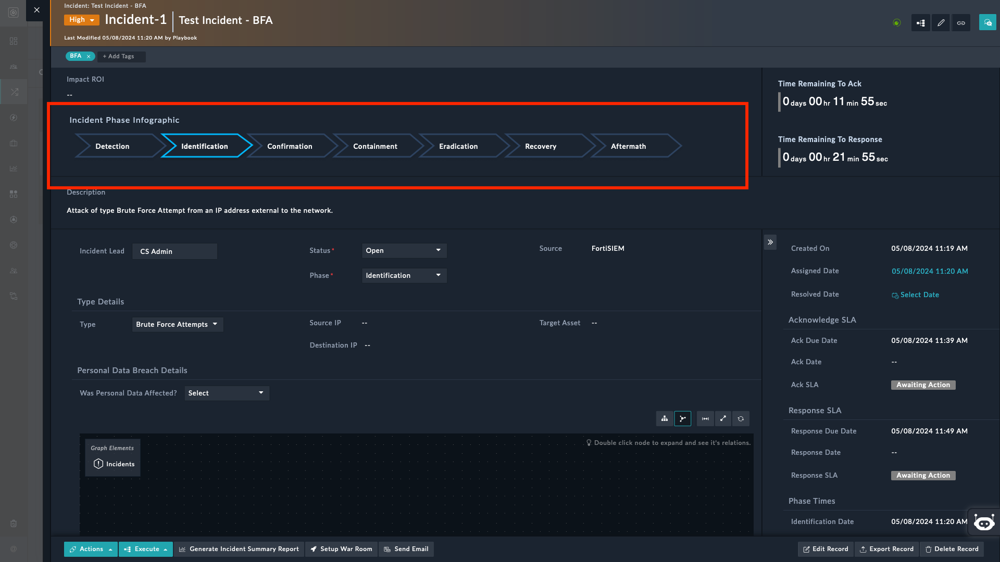

# Release Information

- **Version**: 1.0.0
- **Certified**: No
- **Publisher**: Fortinet
- **Compatible Version**: 7.4.3 or Later

# Overview

**Purpose**

- The widget is designed to display picklist values as phases in a flow diagram format. Each phase represents a specific state or stage in a process.

**Customization**

- You can customize the widget by selecting relevant picklists to include its values in the diagram. For example, if you have a picklist for incident phases (such as *Detection*, *Identification*, and *Confirmation*), you can create a flow diagram showing how incidents transition between these phases.

**Visual Representation**

- The widget visually represents the picklist values within chevron arrows. This visual representation helps to understand the flow of data or processes within FortiSOAR.

    Following image highlights an incident's phases as rendered by the widget:

    

**Use Cases**

- **Incident Management**: You can use the widget to track incident phase changes. For instance, an incident might start in the *Detection* phase, move to *Identification*, and finally transition to *Aftermath*.

- **Workflow Automation**: The widget can also be used to visualize workflow automation. For example, if certain actions are triggered based on picklist values (e.g., *Escalate* when an incident's severity is marked as *High*), the widget can show these transitions.

# Next Steps

| [Installation](./docs/setup.md#installation) | [Configuration](./docs/setup.md#configuration) | [Usage](./docs/usage.md) |
|----------------------------------------------|------------------------------------------------|--------------------------|