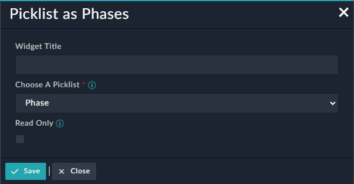

| [Home](../README.md) |
|----------------------|
# Usage

The Picklist as Phases widget shows the selected picklist value in the visual representation i.e. like a flow diagram.

## Picklist as Phases

1. Click to open the detailed view of a record, for example an Incident.

2. Click **Edit Template** to display its System View Template (SVT).

3. Click **Add Widget** and select the **Picklist as Phases** widget from the **Widget Library** section.

4. Specify the title of the widget in the **Title** field.

5. Select the picklist field of the module , whose values is to be displayed, in the **Choose a Picklist** field. The drop-down lists fields of type `Picklist`.

    

6. Select the checkbox **Read Only** to display the flow diagram in read-only mode, else picklist values in the widget will be clickable.

The following screenshot shows the **Picklist as Phases** in action with the selected Picklist.

