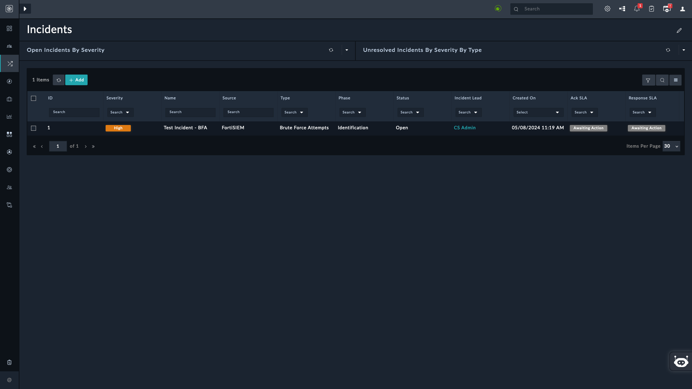
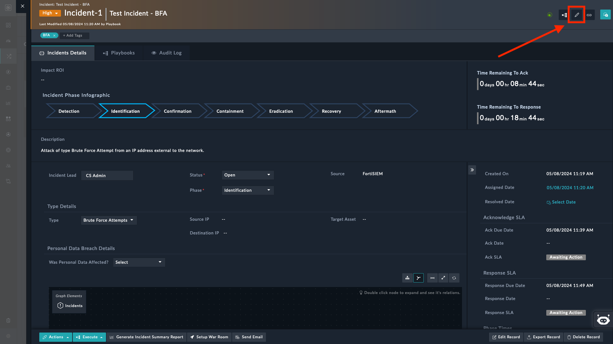
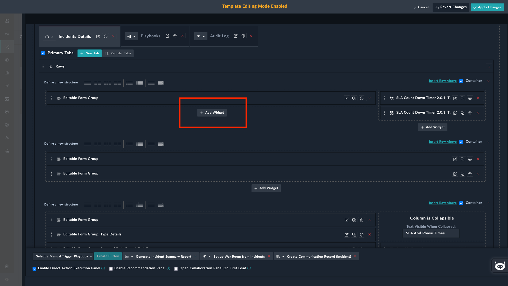
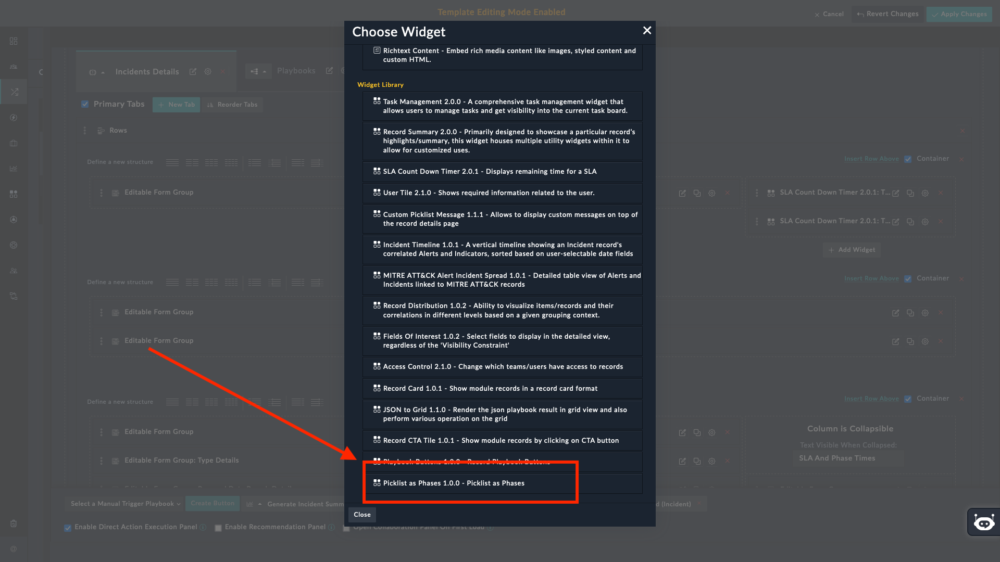
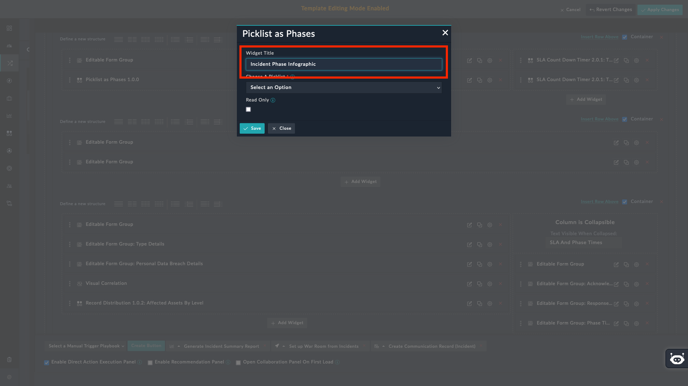
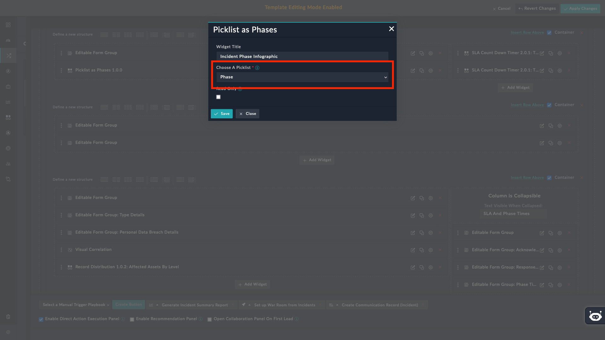
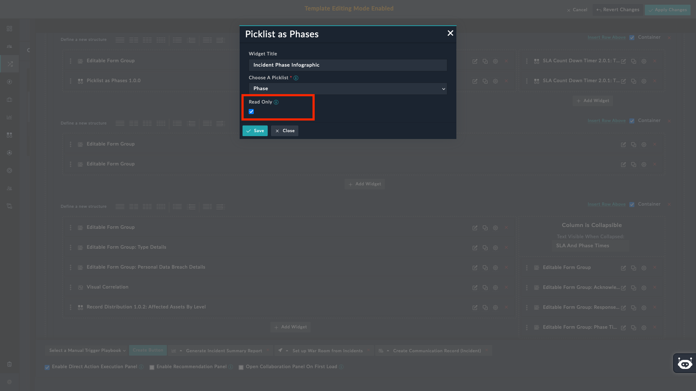

| [Home](../README.md) |
|----------------------|
# Usage

The Picklist as Phases widget shows the selected picklist value in the visual representation i.e. like a flow diagram.

## Picklist as Phases

1. Click to open the detailed view of a record, for example, an *Incident*.

    

2. Click **Edit Template** to display its *System View Template* (SVT).

    

3. Click the **Add Widget** button.

    

4. Select the **Picklist as Phases** widget from the **Choose Widget** dialog.

    

5. Specify the title of the widget in the **Title** field.

    

6. Select the picklist field of the module, whose values are to be displayed, in the **Choose a Picklist** field. The drop-down lists fields of type *`Picklist`*.

    

6. Select the checkbox **Read Only** to display the flow diagram in a *read-only* mode. In *read-only* mode the widget values and states are not *clickable*.

    - To change the picklist value (*Phase* in our case), clear this checkbox. You can then click each *Phase* to change the incident's phase in real-time.

    

The following screenshot shows the **Picklist as Phases** in action with the selected Picklist.

# Next Steps

| [Installation](./setup.md#installation) | [Configuration](./setup.md#configuration) |
|-----------------------------------------|-------------------------------------------|
